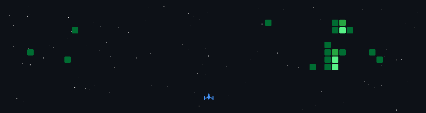

# 👋 Hi, I'm Abhishek Sinha

  

## 🚀 About Me

I’m a **Full Stack Developer** specializing in building **high-performance backend systems**, **secure APIs**, and **scalable web & mobile applications**.

I have strong hands-on experience with the **MERN stack**, modern **DevOps practices**, and production-ready system design. I focus on writing **clean, maintainable, and security-first code**.

---

## 🧠 Tech Stack

### 💻 Languages
- JavaScript
- TypeScript
- Python
- HTML5, CSS3

### 🎨 Frontend
- React.js
- Tailwind CSS
- Framer Motion
- React Query
- Zustand

### ⚙️ Backend
- Node.js
- Express.js
- REST APIs

### 🗄 Databases
- MongoDB
- PostgreSQL
- Redis

### ☁️ DevOps & Cloud
- Docker
- AWS (EC2)
- Nginx
- CI/CD
- Git & GitHub Actions

### 🔐 Security
- JWT Authentication
- OAuth
- Role-Based Access Control (RBAC)
- Rate Limiting

---

## 💼 Experience

### **Full Stack & Mobile Developer (Freelance)**  
**Tech Signific — Remote**  
*Oct 2025 – Present*

- Built fintech mobile applications with strong focus on **security and UX**
- Designed and implemented **Node.js + MongoDB** backends for web & mobile
- Used **Docker** for consistent production deployments
- Implemented **JWT-based authentication** systems

---

### **Full Stack Developer Intern**  
**Tech Signific — Remote**  
*Jan 2025 – Jul 2025*

- Developed backend logic and **RESTful APIs**
- Built responsive UIs using **HTML, CSS, and JavaScript**
- Worked in **Agile teams**, participating in sprints and code reviews

---

## 🧩 Projects

### **ClientFlow**
**React · Node.js · MongoDB · Stripe · Docker**

- Freelance management platform with centralized dashboards
- Dual-portal architecture with **RBAC**
- Stripe integration for payments and financial tracking
- Fully containerized using Docker

---

### **Vera**
**React · TypeScript · Express · MongoDB**

- Modern task management app with glassmorphism UI
- Secure authentication and persistent storage
- Performance-optimized for smooth UX

---

## 📈 GitHub Activity Game

This animated game reflects my GitHub contribution activity, automatically updated using **GitHub Actions**.

---

## 📫 Connect With Me

- 💼 LinkedIn: https://www.linkedin.com/in/abhishek-sinha-0897aa23b
- 💻 GitHub: https://github.com/abhisheksinha20p
- 📧 Email: abhisheksinha20009k@gmail.com

---

⭐ If you like my work, feel free to star my repositories!
