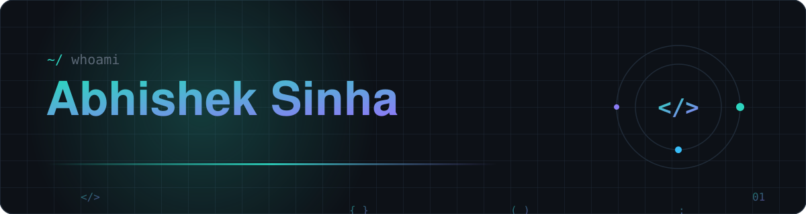

<!-- ============================= HERO ============================= -->
<div align="center">



<br />

<a href="https://github.com/abhisheksinha20p">
  
</a>

<br /><br />

<a href="https://www.linkedin.com/in/abhishek-sinha-0897aa23b"></a>
<a href="https://abhisheksinha.netlify.app/"></a>
<a href="mailto:abhisheksinha20009k@gmail.com"></a>
<a href="https://mycodeyatra.com"></a>

<br />


</div>


<!-- ============================= ABOUT ============================= -->
## `~/` whoami

```ts
const abhishek: Developer = {
  role:        "Full Stack & Mobile App Developer",
  mobile:      ["React Native", "iOS", "Android"],
  web:         ["React", "TypeScript", "Next.js", "Node.js"],
  building:    "mycodeyatra.com",            // multi-author blog · Vercel + MongoDB Atlas
  specialties: ["microservices", "real-time backends", "DevOps pipelines"],
  openTo:      ["open source", "system-design challenges", "full-time roles"],
};
```

I own products end-to-end — from architecture and backend engineering to deployment and production monitoring — across **React Native** mobile apps and **React** web platforms backed by **Node.js** microservices.


<!-- ============================= STACK ============================= -->
<div align="center">

## `~/` toolbox


<br /><br />

<picture>
  <source media="(prefers-color-scheme: dark)" srcset="assets/radar-dark.svg">
  <source media="(prefers-color-scheme: light)" srcset="assets/radar-light.svg">
  
</picture>
&nbsp;&nbsp;


</div>


<!-- ============================= ACTIVITY ============================= -->
<div align="center">

## `~/` activity


<br /><br />


&nbsp;


</div>


<!-- ============================= EXPERIENCE ============================= -->
## `~/` experience

**🚀 Full Stack & Mobile Developer** &nbsp;·&nbsp; Tech Signific &nbsp;·&nbsp; *Oct 2025 – Present*
- Architected multi-tenant **SaaS platforms** with React Native mobile apps and React admin dashboards.
- Designed **Node.js microservices** with Kafka event-driven communication, Redis caching, Socket.IO real-time, and an NGINX API gateway.
- Built **DevOps** pipelines with Docker, GitHub Actions, AWS EC2, Prometheus and Grafana.

**🛠 Full Stack Developer Intern** &nbsp;·&nbsp; Tech Signific &nbsp;·&nbsp; *Jan 2025 – Jul 2025*
- Shipped REST APIs with Node.js and Express plus responsive React interfaces.
- Improved backend performance and reliability through Agile sprints using Git and Jira.


<!-- ============================= PROJECTS ============================= -->
<div align="center">

## `~/` selected work

<table>
<tr>
<td width="50%">
  <picture>
    <source media="(prefers-color-scheme: dark)" srcset="assets/card-restaurant-dark.svg">
    <source media="(prefers-color-scheme: light)" srcset="assets/card-restaurant-light.svg">
    
  </picture>
</td>
<td width="50%">
  <picture>
    <source media="(prefers-color-scheme: dark)" srcset="assets/card-school-dark.svg">
    <source media="(prefers-color-scheme: light)" srcset="assets/card-school-light.svg">
    
  </picture>
</td>
</tr>
<tr>
<td width="50%">
  <picture>
    <source media="(prefers-color-scheme: dark)" srcset="assets/card-clientflow-dark.svg">
    <source media="(prefers-color-scheme: light)" srcset="assets/card-clientflow-light.svg">
    
  </picture>
</td>
<td width="50%">
  <picture>
    <source media="(prefers-color-scheme: dark)" srcset="assets/card-vera-dark.svg">
    <source media="(prefers-color-scheme: light)" srcset="assets/card-vera-light.svg">
    
  </picture>
</td>
</tr>
</table>

</div>


<!-- ============================= CONNECT ============================= -->
<div align="center">

## `~/` let's connect

<a href="https://www.linkedin.com/in/abhishek-sinha-0897aa23b"></a>
<a href="https://abhisheksinha.netlify.app/"></a>
<a href="mailto:abhisheksinha20009k@gmail.com"></a>

<br /><br />

*If you like my work or find my projects useful, drop a ⭐ and say hello.*


</div>
