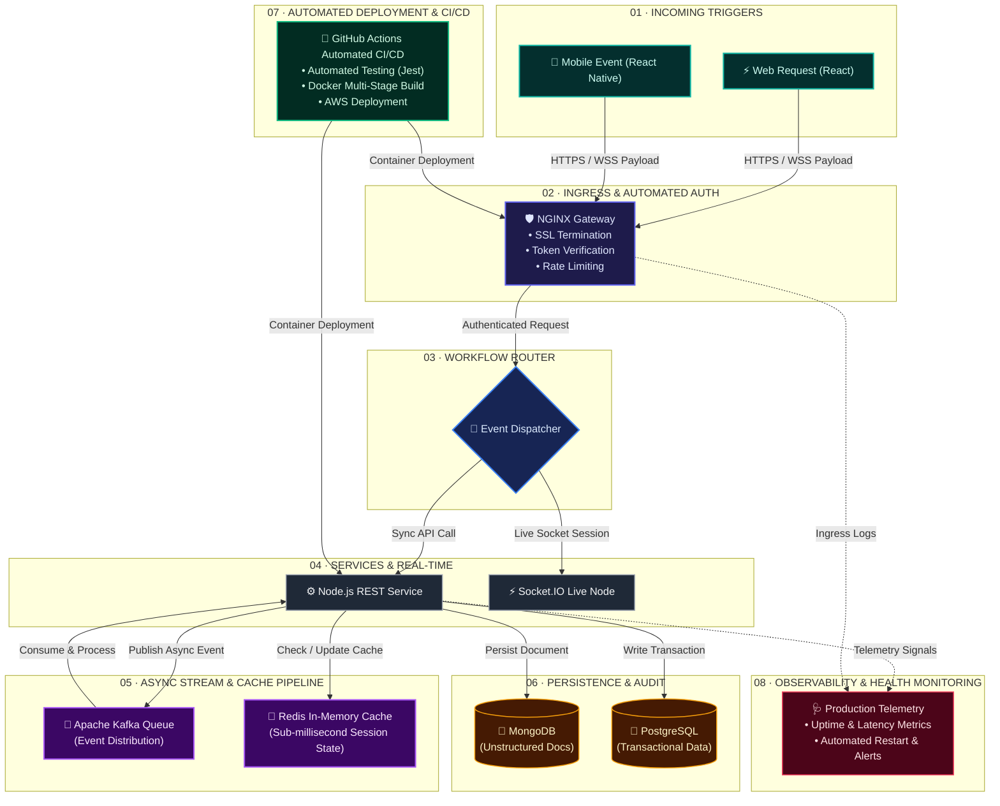

# ⚡ Abhishek Sinha

## Frontline Deployment Engineer · Full-Stack & Mobile Engineer · Production Systems & AI

*Architecting, deploying, and automating resilient full-stack and mobile systems from local container to cloud scale.*

---

## 🎮 Contribution Game

---

## 🚀 About Me

I am a **Frontline Deployment Engineer and Full-Stack & Mobile Developer** focused on building, integrating, deploying, and supporting production-grade software systems.

- 🏗️ **Full-Stack & Mobile:** React, React Native, TypeScript, Tailwind CSS
- ⚙️ **Backend & Microservices:** Node.js, Express, REST APIs, WebSockets (Socket.IO)
- 📨 **Distributed & Real-Time:** Apache Kafka, Redis caching & pub/sub
- 🗄️ **Databases:** MongoDB, PostgreSQL
- ☁️ **Cloud & DevOps:** Docker, AWS, NGINX, GitHub Actions CI/CD workflows
- 🤖 **Automation & AI:** End-to-end automated pipelines, agentic workflows, and production systems observability

---

## 🧠 Tech Stack

| Domain | Technologies |
| :--- | :--- |
| **Languages** |      |
| **Frontend & Mobile** |     |
| **Backend & Messaging** |     |
| **Databases & Cache** |    |
| **Cloud & DevOps** |     |
| **Tools & Testing** |    |

---

## ⚡ Automated End-to-End Workflow Architecture

This workflow models how requests, services, asynchronous messaging, and deployment pipelines operate in an automated node-to-node execution pipeline:

```mermaid
flowchart TD
    %% Node-to-node automated series styling
    classDef triggerNode fill:#042f2e,stroke:#14b8a6,stroke-width:2px,color:#ccfbf1;
    classDef gatewayNode fill:#1e1b4b,stroke:#6366f1,stroke-width:2px,color:#e0e7ff;
    classDef routerNode fill:#172554,stroke:#3b82f6,stroke-width:2px,color:#dbeafe;
    classDef serviceNode fill:#1f2937,stroke:#9ca3af,stroke-width:1.5px,color:#f3f4f6;
    classDef eventNode fill:#3b0764,stroke:#a855f7,stroke-width:2px,color:#fae8ff;
    classDef dataNode fill:#451a03,stroke:#f59e0b,stroke-width:1.5px,color:#fef3c7;
    classDef deployNode fill:#022c22,stroke:#10b981,stroke-width:2px,color:#d1fae5;
    classDef healthNode fill:#4c0519,stroke:#f43f5e,stroke-width:1.5px,color:#ffe4e6;

    subgraph Step1 ["01 · INCOMING TRIGGERS"]
        T1["⚡ Web Request (React)"]
        T2["📱 Mobile Event (React Native)"]
    end
    class T1,T2 triggerNode;

    subgraph Step2 ["02 · INGRESS & AUTOMATED AUTH"]
        GW["🛡️ NGINX Gateway<br/>• SSL Termination<br/>• Token Verification<br/>• Rate Limiting"]
    end
    class GW gatewayNode;

    subgraph Step3 ["03 · WORKFLOW ROUTER"]
        Router{"🔀 Event Dispatcher"}
    end
    class Router routerNode;

    subgraph Step4 ["04 · SERVICES & REAL-TIME"]
        S_REST["⚙️ Node.js REST Service"]
        S_RT["⚡ Socket.IO Live Node"]
    end
    class S_REST,S_RT serviceNode;

    subgraph Step5 ["05 · ASYNC STREAM & CACHE PIPELINE"]
        Q_Kafka["📨 Apache Kafka Queue<br/>(Event Distribution)"]
        C_Redis["🚀 Redis In-Memory Cache<br/>(Sub-millisecond Session State)"]
    end
    class Q_Kafka,C_Redis eventNode;

    subgraph Step6 ["06 · PERSISTENCE & AUDIT"]
        DB_Mongo[("🍃 MongoDB<br/>(Unstructured Docs)")]
        DB_PG[("🐘 PostgreSQL<br/>(Transactional Data)")]
    end
    class DB_Mongo,DB_PG dataNode;

    subgraph Step7 ["07 · AUTOMATED DEPLOYMENT & CI/CD"]
        CI_Pipeline["🤖 GitHub Actions Automated CI/CD<br/>• Automated Testing (Jest)<br/>• Docker Multi-Stage Build<br/>• AWS Deployment"]
    end
    class CI_Pipeline deployNode;

    subgraph Step8 ["08 · OBSERVABILITY & HEALTH MONITORING"]
        Health["🩺 Production Telemetry<br/>• Uptime & Latency Metrics<br/>• Automated Restart & Alerts"]
    end
    class Health healthNode;

    %% Automated Series Connectors
    T1 & T2 -->|HTTPS / WSS Payload| GW
    GW -->|Authenticated Request| Router
    Router -->|Sync API Call| S_REST
    Router -->|Live Socket Session| S_RT
    S_REST -->|Check / Update Cache| C_Redis
    S_REST -->|Publish Async Event| Q_Kafka
    Q_Kafka -->|Consume & Process| S_REST
    S_REST -->|Persist Document| DB_Mongo
    S_REST -->|Write Transaction| DB_PG
    CI_Pipeline -->|Container Deployment| GW
    CI_Pipeline -->|Container Deployment| S_REST
    S_REST -.->|Telemetry Signals| Health
    GW -.->|Ingress Logs| Health
```

---

## 💼 Experience

### 🚀 Frontline Deployment Engineer / Full-Stack & Mobile Developer

**TechSignific** · *Oct 2025 – Present*

- Architecting and shipping multi-tenant full-stack and mobile applications across web and mobile platforms.
- Building modular backend microservices with **Node.js**, **REST APIs**, and **Socket.IO** for real-time workflows.
- Implementing asynchronous event-driven pipelines using **Apache Kafka** and caching layers via **Redis**.
- Hardening production deployments using **Docker**, **AWS**, **NGINX**, and automated **GitHub Actions** CI/CD pipelines.
- Troubleshooting application, network, and infrastructure issues across staging and production environments.

### 💻 Full-Stack Developer Intern

**TechSignific** · *Jan 2025 – Jul 2025*

- Developed backend RESTful services using **Node.js** and **Express**.
- Built responsive client interfaces using **React**, **HTML5**, **CSS3**, and **JavaScript**.
- Participated in Agile sprint planning, code reviews, and Git-based collaborative workflows.

---

## 🧩 Featured Projects

### 🍽️ Restaurant Management SaaS

*Multi-tenant SaaS platform unifying mobile apps, backend services, real-time workflows, and deployment infrastructure.*

- **Tech Stack:** `React Native` · `Node.js` · `Kafka` · `Redis` · `Docker` · `AWS`
- Real-time order tracking, operational workflows, and table management
- Microservices architecture connected via event-driven Kafka messaging
- Containerized deployment with secure API gateway routing and rate limiting

### 🏫 School Operations SaaS

*Multi-role school management system supporting operational workflows across administration, parents, and transportation.*

- **Tech Stack:** `React Native` · `Node.js` · `Kafka` · `MongoDB` · `Docker`
- Live vehicle transport tracking and automated attendance workflows
- Granular Role-Based Access Control (RBAC) across multiple user tiers
- Service-oriented backend with containerized Docker deployment

### 💼 ClientFlow

*End-to-end freelancer operations platform for handling clients, projects, billing, and collaboration.*

- **Tech Stack:** `React` · `Node.js` · `Stripe` · `Docker` · `AWS`
- Client relationship, project management, and automated invoicing with Stripe
- Multi-role dashboards with secure authentication workflows

### ✨ Vera

*Focused productivity and task management web application crafted with modern interaction design.*

- **Tech Stack:** `React` · `TypeScript` · `Express` · `MongoDB`
- Focus dashboard with priority sorting and task scheduling
- Smooth glassmorphism-inspired UI with optimized frontend state management

---

## 🎓 Education

**Bachelor of Engineering — Electronics & Communication Engineering**  
*Gogte Institute of Technology, Belagavi* · *2020 – 2024*

---

## 📈 Live Activity & Stats

---

## 🤝 Let's Connect & Collaborate

*Have an interesting engineering problem or building a distributed, deployment-critical product? Feel free to connect or drop a message!*
