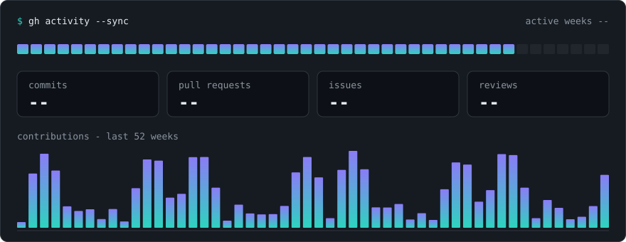

<div align="center">



# Abhishek Sinha

**Full Stack & Mobile Developer** · building scalable SaaS and real-time systems

[](https://www.linkedin.com/in/abhishek-sinha-0897aa23b)
[](https://abhisheksinha.netlify.app/)
[](mailto:abhisheksinha20009k@gmail.com)

</div>

<br />

```ts
const abhishek = {
  role: "Full Stack & Mobile Developer",
  mobile: ["React Native", "iOS", "Android"],
  web: ["React", "TypeScript", "Node.js"],
  building: "mycodeyatra.com", // multi-author blogging platform
  openTo: ["open source", "system design", "full-time roles"],
};
```

I own products end-to-end: React Native and web front ends, Node.js microservices, deployment and production monitoring.

---

## Activity

<p align="center">
  
</p>

<p align="center">
  <a href="https://github.com/abhisheksinha20p">
    
  </a>
</p>

---

## Experience

**Full Stack & Mobile Developer (Freelance)** · Tech Signific · *Oct 2025 – Present*
- Architected multi-tenant SaaS platforms with React Native mobile apps and React admin dashboards.
- Designed Node.js microservices with Kafka event-driven communication, Redis caching, Socket.IO and an NGINX gateway.
- Set up DevOps with Docker, GitHub Actions, AWS EC2, Prometheus and Grafana.

**Full Stack Developer Intern** · Tech Signific · *Jan 2025 – Jul 2025*
- Built REST APIs with Node.js and Express and responsive React interfaces.
- Improved backend performance and reliability in Agile sprints using Git and Jira.

---

## Projects

| | Project | Highlights | Stack |
|---|---|---|---|
| 📱 Mobile | **Restaurant Management SaaS** | Real-time order tracking, event-driven microservices, API gateway with rate limiting | React Native, Node.js, Kafka, Redis, Docker, AWS |
| 📱 Mobile | **School Operations SaaS** | Real-time transport tracking, automated attendance, RBAC access control | React Native, Node.js, Kafka, MongoDB, Docker |
| 🌐 Web | **ClientFlow** | Stripe payments, JWT auth, role-based dashboards | React, Node.js, Stripe, Docker, AWS |
| 🌐 Web | **Vera** | Task management with glassmorphism UI and optimized frontend performance | React, TypeScript, Express, MongoDB |

---

## Stack

<table>
  <tr>
    <td><b>Languages</b></td>
    <td>
      
      
      
      
      
    </td>
  </tr>
  <tr>
    <td><b>Mobile</b></td>
    <td></td>
  </tr>
  <tr>
    <td><b>Web</b></td>
    <td>
      
      
      
      
    </td>
  </tr>
  <tr>
    <td><b>Backend</b></td>
    <td>
      
      
      
      
    </td>
  </tr>
  <tr>
    <td><b>Data & Cloud</b></td>
    <td>
      
      
      
      
      
      
    </td>
  </tr>
</table>

---

<div align="center">

If you like my work or find my projects useful, star a repository and say hello.

</div>
