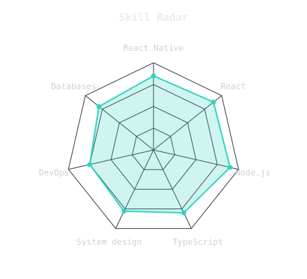
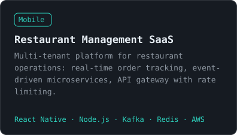
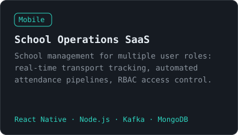
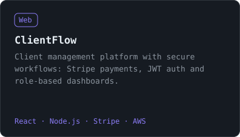
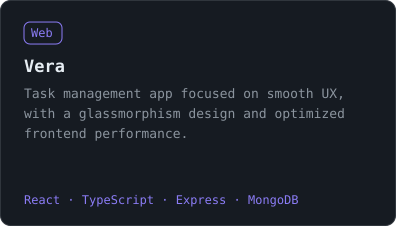

<div align="center">

<!-- Pixel hologram. Regenerate from your photo:  python scripts/hologram.py --photo assets/me.jpg -->


<a href="https://github.com/abhisheksinha20p">
  
</a>

<br />

[](https://www.linkedin.com/in/abhishek-sinha-0897aa23b)
[](https://abhisheksinha.netlify.app/)
[](mailto:abhisheksinha20009k@gmail.com)


</div>

---

## `~/` whoami

```ts
const abhishek = {
  role: "Full Stack & Mobile Developer",
  mobile: ["React Native", "iOS", "Android"],
  web: ["React", "TypeScript", "Node.js"],
  building: "mycodeyatra.com", // multi-author blogging platform on Vercel + MongoDB Atlas
  specialties: ["microservices", "DevOps pipelines", "real-time backends"],
  openTo: ["open source", "system design challenges", "full-time roles"],
};
```

I own products end-to-end: React Native and web front ends, Node.js microservices, deployment and production monitoring.

---

<div align="center">

## `~/` toolbox


<br /><br />

<table>
<tr>
<td width="50%" align="center" valign="middle">

<!-- Self-rated: edit assets/skills.json, the workflow redraws it -->
<picture>
  <source media="(prefers-color-scheme: dark)" srcset="assets/radar-dark.svg">
  <source media="(prefers-color-scheme: light)" srcset="assets/radar-light.svg">
  
</picture>

</td>
<td width="50%" align="center" valign="middle">

<!-- Built from real language byte counts across your repos -->
<picture>
  <source media="(prefers-color-scheme: dark)" srcset="assets/radar-langs-dark.svg">
  <source media="(prefers-color-scheme: light)" srcset="assets/radar-langs-light.svg">
  
</picture>

</td>
</tr>
</table>

</div>

---

<div align="center">

## `~/` activity

<!-- Generated from your real contribution calendar by scripts/activity.py -->


<br /><br />

<picture>
  <source media="(prefers-color-scheme: dark)" srcset="assets/card-stats-dark.svg">
  <source media="(prefers-color-scheme: light)" srcset="assets/card-stats-light.svg">
  
</picture>

<br /><br />

<!-- Snake eats the contribution graph: .github/workflows/snake.yml -->
<picture>
  <source media="(prefers-color-scheme: dark)" srcset="https://raw.githubusercontent.com/abhisheksinha20p/abhisheksinha20p/output/snake-dark.svg">
  <source media="(prefers-color-scheme: light)" srcset="https://raw.githubusercontent.com/abhisheksinha20p/abhisheksinha20p/output/snake.svg">
  
</picture>

</div>

---

## `~/` experience

**Full Stack & Mobile Developer (Freelance)** · Tech Signific · *Oct 2025 – Present*
- Architected multi-tenant SaaS platforms with React Native mobile apps and React admin dashboards.
- Designed Node.js microservices with Kafka event-driven communication, Redis caching, Socket.IO and an NGINX API gateway.
- Set up DevOps with Docker, GitHub Actions, AWS EC2, Prometheus and Grafana.

**Full Stack Developer Intern** · Tech Signific · *Jan 2025 – Jul 2025*
- Built REST APIs with Node.js and Express and responsive React interfaces.
- Improved backend performance and reliability in Agile sprints using Git and Jira.

---

<div align="center">

## `~/` selected work

<!-- Cards come from assets/projects.json via scripts/cards.py -->
<table>
<tr>
<td width="50%">
  <picture>
    <source media="(prefers-color-scheme: dark)" srcset="assets/card-restaurant-dark.svg">
    <source media="(prefers-color-scheme: light)" srcset="assets/card-restaurant-light.svg">
    
  </picture>
</td>
<td width="50%">
  <picture>
    <source media="(prefers-color-scheme: dark)" srcset="assets/card-school-dark.svg">
    <source media="(prefers-color-scheme: light)" srcset="assets/card-school-light.svg">
    
  </picture>
</td>
</tr>
<tr>
<td width="50%">
  <picture>
    <source media="(prefers-color-scheme: dark)" srcset="assets/card-clientflow-dark.svg">
    <source media="(prefers-color-scheme: light)" srcset="assets/card-clientflow-light.svg">
    
  </picture>
</td>
<td width="50%">
  <picture>
    <source media="(prefers-color-scheme: dark)" srcset="assets/card-vera-dark.svg">
    <source media="(prefers-color-scheme: light)" srcset="assets/card-vera-light.svg">
    
  </picture>
</td>
</tr>
</table>

</div>

---

<div align="center">

## `~/` let's connect

[](https://www.linkedin.com/in/abhishek-sinha-0897aa23b)
[](https://abhisheksinha.netlify.app/)
[](mailto:abhisheksinha20009k@gmail.com)

If you like my work or find my projects useful, star a repository and say hello.


</div>
