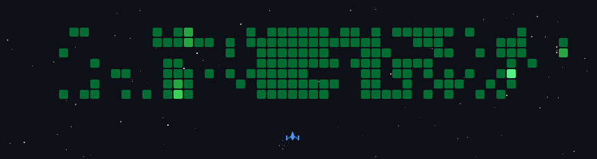

<div align="center">
  <h1>👋 Hi, I'm Abhishek Sinha</h1>
  <h3>Frontline Deployment Engineer | Full-Stack & Mobile Engineer | Production Systems & AI</h3>
</div>

---

<!-- ========================================================= -->
<!-- ORIGINAL RETRO CONTRIBUTION GAME — KEEP THIS SECTION       -->
<!-- ========================================================= -->

<p align="center">
  
</p>

<!-- ========================================================= -->
<!-- END ORIGINAL RETRO CONTRIBUTION GAME                      -->
<!-- ========================================================= -->

<div align="center">
  <a href="https://www.linkedin.com/in/abhishek-sinha-0897aa23">
    
  </a>

  <a href="https://abhisheksinha.netlify.app/">
    
  </a>

  <a href="mailto:abhisheksinha20009k@gmail.com">
    
  </a>
</div>

---

## 🚀 About Me

I'm a **Frontline Deployment Engineer and Full-Stack & Mobile Developer** focused on building, integrating, deploying, and supporting production-grade software systems.

My work spans the complete engineering lifecycle — from architecture and application development to APIs, infrastructure, deployment, production debugging, and system reliability.

```text
┌──────────────────────────────────────────────────────────┐
│                    ENGINEERING LIFECYCLE                 │
├──────────────────────────────────────────────────────────┤
│                                                          │
│  Architecture                                            │
│       ↓                                                  │
│  Application Development                                 │
│       ↓                                                  │
│  APIs & Backend Services                                 │
│       ↓                                                  │
│  Databases & Authentication                              │
│       ↓                                                  │
│  Distributed Systems                                     │
│       ↓                                                  │
│  Containerization & CI/CD                                │
│       ↓                                                  │
│  Cloud & Deployment                                      │
│       ↓                                                  │
│  Production Debugging & Reliability                      │
│                                                          │
└──────────────────────────────────────────────────────────┘
```

### 🔭 What I Do

- 🏗️ Build **full-stack and mobile applications**
- ⚙️ Design **backend services and microservice architectures**
- 📨 Build **event-driven systems** using Kafka
- ⚡ Develop **real-time systems** using Socket.IO
- 🐳 Containerize applications using **Docker**
- 🚀 Build **CI/CD and deployment workflows**
- ☁️ Work with **AWS and production infrastructure**
- 🔐 Implement **authentication, authorization, RBAC, and API security**
- 🗄️ Work with **MongoDB, PostgreSQL, and Redis**
- 🤖 Explore **AI/ML and AI-enabled software systems**

---

## 🧭 Engineering Focus

I'm particularly interested in the intersection of:

**Software Engineering + Product Engineering + Deployment + Infrastructure + AI**

I enjoy solving problems beyond isolated feature development — understanding the environment, integrating systems, deploying applications, debugging production issues, and delivering reliable software.

```text
Understand the Problem
        ↓
Understand the Environment
        ↓
Design the Solution
        ↓
Build / Integrate
        ↓
Connect Services
        ↓
Deploy
        ↓
Debug
        ↓
Improve
        ↓
Deliver
```

---

## 🧠 Tech Stack

### 💻 Languages


### 🎨 Frontend & Mobile


### ⚙️ Backend & Architecture


### 🗄️ Databases & Caching


### ☁️ Cloud & DevOps


### 🔐 Engineering & Security


---

## 🏗️ Architecture & Systems

My interests and experience cover multiple layers of modern software systems:

```text
                         CLIENTS
              ┌────────────┴────────────┐
              │                         │
         React Web                React Native
              │                         │
              └────────────┬────────────┘
                           ↓
                     API / Gateway
                           ↓
                 ┌─────────┴─────────┐
                 │                   │
             REST APIs          Real-Time
                 │              Socket.IO
                 │                   │
                 └─────────┬─────────┘
                           ↓
                   Backend Services
                           ↓
                 ┌─────────┴─────────┐
                 │                   │
              Kafka               Redis
                 │                   │
                 └─────────┬─────────┘
                           ↓
                    Data Layer
                 ┌─────────┴─────────┐
                 │                   │
             MongoDB             PostgreSQL
                           ↓
                    Docker / NGINX
                           ↓
                      AWS / Cloud
                           ↓
                    Production
```

---

## 📈 GitHub Stats

<div align="center">

[](https://github.com/abhisheksinha20p)

</div>

---

## 💼 Experience

### 🚀 Frontline Deployment Engineer / Full-Stack & Mobile Developer

**TechSignific** · *Oct 2025 – Present*

Working across application engineering, backend architecture, deployment, integration, and production systems.

- Architecting and developing **full-stack and mobile applications** across web and mobile platforms.
- Building backend services using **Node.js, REST APIs, and microservice-oriented architecture**.
- Working with **MongoDB, Docker, authentication, API security, and production environments**.
- Developing **event-driven systems** using Apache Kafka.
- Building **real-time application workflows** using Socket.IO.
- Working with **Redis caching and performance-oriented backend systems**.
- Building deployment workflows using **Docker, GitHub Actions, AWS, and NGINX**.
- Contributing across the complete lifecycle from **development and integration to deployment and production support**.
- Troubleshooting application and infrastructure issues across development and production environments.

### 💻 Full-Stack Developer Intern

**TechSignific** · *Jan 2025 – Jul 2025*

- Developed server-side applications and **RESTful APIs using Node.js and Express**.
- Built responsive web interfaces using **HTML, CSS, JavaScript, and React**.
- Participated in **Agile development, sprint planning, and code reviews**.
- Worked with Git-based development workflows and team collaboration.
- Contributed to backend development and application delivery throughout the development lifecycle.

---

## 🧩 Featured Projects

<table>
  <tr>
    <td width="50%">
      <h3>🍽️ Restaurant Management SaaS</h3>

      <p>
        Multi-tenant SaaS platform for restaurant operations,
        combining mobile applications, backend services,
        real-time workflows, and deployment infrastructure.
      </p>

      <p>
        <strong>Tech:</strong>
        React Native · Node.js · Kafka · Redis · Docker · AWS
      </p>

      <ul>
        <li>Real-time order and operational workflows</li>
        <li>Event-driven microservices architecture</li>
        <li>API gateway and rate-limiting capabilities</li>
        <li>Containerized deployment architecture</li>
      </ul>
    </td>

    <td width="50%">
      <h3>🏫 School Operations SaaS</h3>

      <p>
        Multi-role school management platform designed to support
        operational workflows across different user types.
      </p>

      <p>
        <strong>Tech:</strong>
        React Native · Node.js · Kafka · MongoDB · Docker
      </p>

      <ul>
        <li>Real-time transport tracking</li>
        <li>Automated attendance workflows</li>
        <li>RBAC-secured access control</li>
        <li>Service-oriented backend architecture</li>
      </ul>
    </td>
  </tr>

  <tr>
    <td width="50%">
      <h3>💼 ClientFlow</h3>

      <p>
        Freelancer management platform for handling clients,
        projects, invoices, communication, and business workflows.
      </p>

      <p>
        <strong>Tech:</strong>
        React · Node.js · Stripe · Docker · AWS
      </p>

      <ul>
        <li>Client and project management</li>
        <li>Invoice and billing workflows</li>
        <li>Secure authentication</li>
        <li>Role-based dashboards</li>
      </ul>
    </td>

    <td width="50%">
      <h3>✨ Vera</h3>

      <p>
        Modern full-stack task-management application focused
        on productivity and a smooth user experience.
      </p>

      <p>
        <strong>Tech:</strong>
        React · TypeScript · Express · MongoDB
      </p>

      <ul>
        <li>Task and productivity management</li>
        <li>Focus-oriented dashboard</li>
        <li>Important-task prioritization</li>
        <li>Glassmorphism-inspired interface</li>
      </ul>
    </td>
  </tr>
</table>

---

## 🎓 Education

### Bachelor of Engineering — Electronics & Communication Engineering

**Gogte Institute of Technology, Belagavi** · *2020 – 2024*

My engineering journey has evolved through:

```text
ECE
 ↓
Software Development
 ↓
Full-Stack Engineering
 ↓
Mobile Development
 ↓
Backend & Architecture
 ↓
Deployment & Production Engineering
```

---

## 🤖 AI & Emerging Technology

I'm actively interested in the next generation of software engineering:

- 🤖 AI-powered applications
- 🧠 AI/ML engineering
- 🧩 AI agents and agentic workflows
- 🔗 AI system integration
- 🛠️ AI developer tooling
- 🏠 Local AI / LLM infrastructure
- 📊 AI evaluation and observability
- ☁️ AI deployment

---

## 📊 Beyond Software Engineering

My technical interests also extend into:

- Data analysis
- Data visualization
- Business analytics
- Financial technology
- Market analysis
- Product engineering
- System design
- Production reliability

---

## 🌱 Currently Exploring

```text
AI Engineering
       +
Distributed Systems
       +
Cloud Infrastructure
       +
Production Deployment
       +
Developer Automation
       +
Full-Stack & Mobile Systems
```

---

## 🤝 Let's Connect

I'm interested in **Frontline Deployment Engineering, Full-Stack Development, Mobile Engineering, Production Systems, AI-enabled products, system architecture, and challenging engineering problems.**

If you're building something interesting, feel free to connect.

<div align="center">

<a href="https://www.linkedin.com/in/abhishek-sinha-0897aa23">
  
</a>

<a href="https://abhisheksinha.netlify.app/">
  
</a>

<a href="mailto:abhisheksinha20009k@gmail.com">
  
</a>

</div>

---

<div align="center">

### ⚡ Build · Deploy · Debug · Improve

</div>
